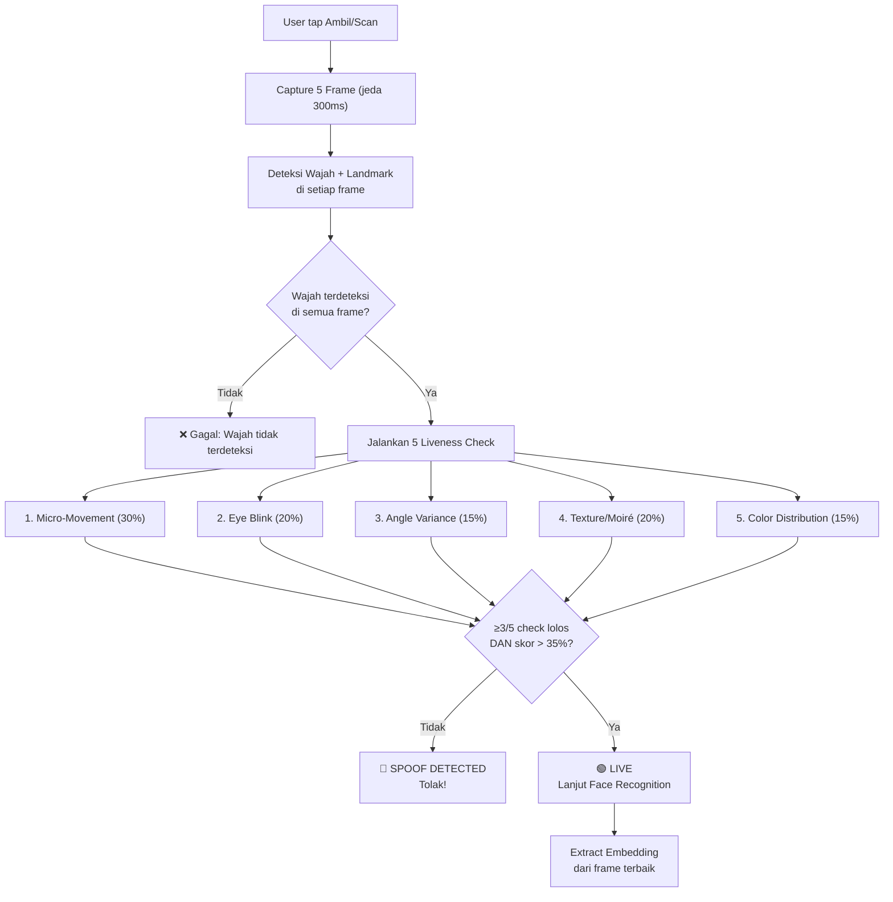

# 🔒 Passive Liveness Detection — Implementasi

## Arsitektur



## File yang Dibuat/Diubah

| File | Aksi | Deskripsi |
|------|------|-----------|
| [livenessDetection.js](file:///c:/ReactApp/mfnet/utils/livenessDetection.js) | **Baru** | Modul passive liveness detection |
| [App.js](file:///c:/ReactApp/mfnet/App.js) | **Diubah** | Integrasi liveness ke flow register & verify |

## Detail 5 Check Anti-Spoofing

### 1. Micro-Movement (Bobot: 30%)
Mendeteksi gerakan mikro landmark wajah (mata, hidung, mulut) antar frame. Orang hidup selalu punya gerakan halus dari napas dan micro-expression. Foto → variasi ≈ 0.

### 2. Eye Blink (Bobot: 20%)
Menganalisis fluktuasi `leftEyeOpenProbability` dan `rightEyeOpenProbability` antar frame. Mata manusia berkedip secara alami, foto memiliki nilai konstan.

### 3. Angle Variance (Bobot: 15%)
Memeriksa variasi `rollAngle` dan `yawAngle` kepala antar frame. Kepala manusia punya gerakan halus, foto/layar statis.

### 4. Texture / Moiré Detection (Bobot: 20%)
Menggunakan Laplacian edge detection dan periodicity analysis pada piksel wajah yang di-crop. Layar HP/monitor menghasilkan pola moiré saat difoto ulang.

### 5. Color Distribution (Bobot: 15%)
Menganalisis distribusi warna (RGB variance) area wajah. Kulit asli punya distribusi warna alami, layar/foto cetak lebih uniform.

## Threshold

| Parameter | Nilai | Keterangan |
|-----------|-------|------------|
| `LIVENESS_THRESHOLD` | 0.35 | Skor minimum weighted average |
| `LIVENESS_MIN_CHECKS_PASSED` | 3 | Minimal check yang harus lolos (dari 5) |
| `LIVENESS_FRAME_COUNT` | 5 | Jumlah frame yang diambil |
| `LIVENESS_FRAME_DELAY_MS` | 300 | Jeda antar frame (ms) |

> [!TIP]
> Threshold bisa disesuaikan di file `utils/livenessDetection.js` baris 7-10. Jika terlalu ketat (banyak false reject), turunkan `LIVENESS_THRESHOLD` atau `LIVENESS_MIN_CHECKS_PASSED`.

## Alur Baru vs Lama

```diff
 User tap "Ambil Master" / "Scan Verifikasi"
-  → Capture 1 foto
-  → Deteksi wajah
-  → Extract embedding
+  → Capture 5 frame (1.5 detik)
+  → Deteksi wajah + landmark di setiap frame
+  → Jalankan 5 passive liveness check
+  → Jika LIVE → extract embedding dari frame terbaik
+  → Jika SPOOF → tolak dengan alert
   → Proses register/verify seperti biasa
```

> [!IMPORTANT]
> Tidak ada dependensi baru yang perlu di-install. Semua menggunakan library yang sudah ada (`expo-face-detector`, `expo-image-manipulator`, `jpeg-js`).
